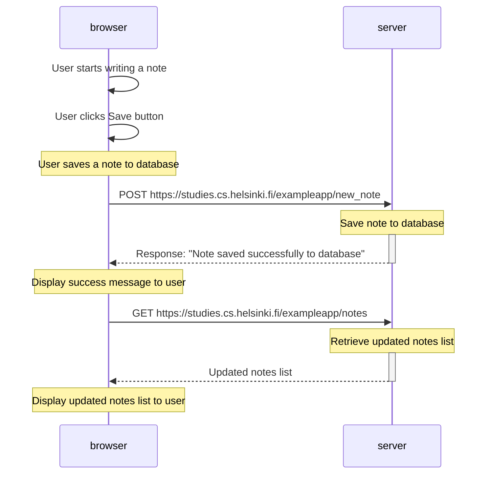

```mermaid
sequenceDiagram
    participant browser
    participant server
    browser->>browser: User starts writing a note
    browser->>browser: User clicks Save button
    Note over browser: User saves a note to database

    browser->>server: POST https://studies.cs.helsinki.fi/exampleapp/new_note
    Note over server: Save note to database
    activate server
    server-->>browser: Response: "Note saved successfully to database"
    deactivate server
    Note over browser: Display success message to user

    browser->>server: GET https://studies.cs.helsinki.fi/exampleapp/notes
    Note over server: Retrieve updated notes list
    activate server
    server-->>browser: Updated notes list
    deactivate server
    Note over browser: Display updated notes list to user
```
